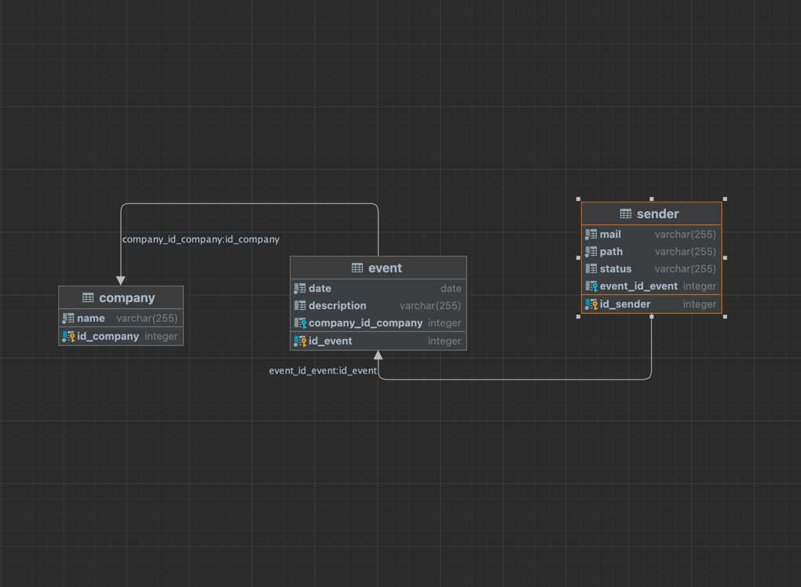

# EventGallery

Приложение для отображения сетки из превью фото-видео контента, расположенного в локальной папке вашего устройства, с
авто-отслеживанием изменений и отправкой выбранного файла на указанную почту.
 
 Основное предназначение - Event мероприятия. Используется вместе с сенсорной стойкой, с которой гости отправляют
материал на свою почту.
 Написано на java, поддерживается любой платформой, на которую можно установить JVM и postgres

#### Функционал:

+ Поддерживает фото\видео контент;
+ Установка цвета фона или изображения (брендирование);
+ Сбор базы данных почтовых ящиков с указанием мепрориятия и файла, выбранного к отправлению;
+ Возможность разделять заказчика (бренд) и наименование мероприятий: Можно найти все почтовые ящики с конкретного
  мероприятия или со всех мероприятий конкретного клиента;
+ Сортировка галереи (по названию файла, по времени добавления в папку);
+ Отображается статус отправления на почту (SUCCESS, ERROR);
+ Синхронизация галереи с содержимым папки: для добавления (удаления) файлов в галерею нужно добавить (удалить) файлы в
  рабочую папку;
+ Сохранение настроек для выбранной папки в config.json

#### Необходимое для работы приложения:

+ JVM
+ Postgres
+ Созданная пустая база данных
+ аккаунт gmail с разрешенным доступом внешних приложений
   
   
   
  Окно настройки:
    
  
   
  Окно галереи:
    
  
   
  Окно просмотра:
    
  
   
  Окно отправки на почту:
    
  
  Схема базы данных:
    
  
